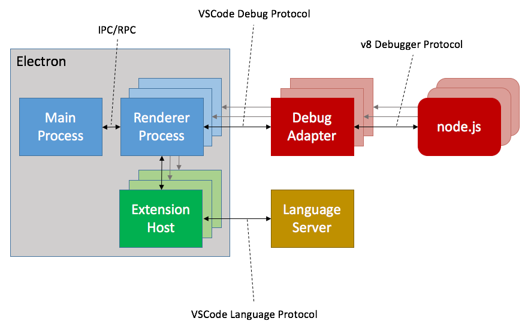

# Core
[Overview](https://github.com/Microsoft/vscode-docs/blob/master/docs/extensions/overview.md)



- Seperate Process and communicate by protocal 
	1) Render process <=> Debug Adaptor(app) <=> real debugger
	2) Extenstion Host <=> Language Server(other process)
- Based on extensions/plugin
- Write Extension/LanguageServer/DebugAdaptor and debug them
	1) run DebugAdaptor process, attach to it in vscode by "debugSerer:4711" in launch.json
	2) merge DebugAdaptor code with extension togerther
	3) LS: client is written by extension which launch server process with listen port. When need debug server, attach to the listen port.
- Contribution concept
- Launch configuration: validate, edit tips, inital value(package.json, DebugConfigurationProvider )


All VS Code extensions share a common model of contribution (registration), activation (loading) and access to the VS Code extensibility API. There are however two special flavors of VS Code extensions, language servers and debuggers, which have their own additional protocols and are covered in their own sections of the documentation.

In order to avoid problems with local firewalls, VS Code communicates with the adapter through stdin/stdout instead of using a more sophisticated mechanism (e.g. sockets).

- When create LSP(language server protol), also create a client and a server.
- When create a debugger, it can be extension and invoke debugger adaptor.

[Language Server Protol](https://code.visualstudio.com/blogs/2016/06/27/common-language-protocol)

[Example](https://github.com/Microsoft/vscode-extension-samples/):

[Doc](https://github.com/Microsoft/vscode-docs/tree/master/docs)

# structure
.vscode/{launch,settings,tasks}.json
extension: package.json, extension.ts // the source of the extension entry point

``` launch.json
{
	"version": "0.2.0",
	"configurations": [
		
		{
			"type": "extensionHost",
			"request": "launch",
			"name": "Extension", // debug extension
			"preLaunchTask": "npm",
			"runtimeExecutable": "${execPath}",
			"args": [
				"--extensionDevelopmentPath=${workspaceFolder}"
			],
			"outFiles": [ "${workspaceFolder}/out/**/*.js" ]
		},
		{
			"type": "node",
			"request": "launch",
			"name": "Server", // debug debug adaptor
			"cwd": "${workspaceFolder}",
			"program": "${workspaceFolder}/src/debugAdapter.ts",
			"args": [ "--server=4711" ],
			"outFiles": [ "${workspaceFolder}/out/**/*.js" ]
		},
		{
			"type": "node",
			"request": "launch",
			"name": "Tests",
			"cwd": "${workspaceFolder}",
			"program": "${workspaceFolder}/node_modules/mocha/bin/_mocha",
			"args": [
				"-u", "tdd",
				"--timeout", "999999",
				"--colors",
				"./out/tests/"
			],
			"outFiles": [ "${workspaceFolder}/out/**/*.js" ],
			"internalConsoleOptions": "openOnSessionStart"
		},
		{
			"type": "mock",
			"request": "launch",
			"name": "Mock Sample",
			"program": "${workspaceFolder}/${command:AskForProgramName}",
			"stopOnEntry": true
		},
		{
			"name": "Attach to Server in LSP",
			"type": "node",
			"request": "attach",
			"port": 6009,
			"sourceMaps": true,
			"outFiles": [
				"${workspaceRoot}/client/server/**/*.js"
			],
			"preLaunchTask": "watch:server"
		}
	],
	"compounds": [
		{
			"name": "Extension + Server",
			"configurations": [ "Extension", "Server" ]
		}
	]
}


// package.json
"debuggers": [{
    "type": "gdb",
    "windows": {
        "program": "./bin/gdbDebug.exe",
    },
    "osx": {
        "program": "./bin/gdbDebug.sh",
    },
    "linux": {
        "program": "./bin/gdbDebug.sh",
    }
}]
```